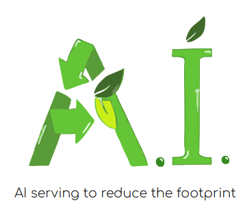

# SustainML

**Application Aware, Life-Cycle Oriented Model-Hardware Co-Design Framework for Sustainable, Energy Efficient ML Systems** project.

<a href="http://www.eprosima.com">
<a href="https://alma-ai.eu/">

*SustainML* is a framework and an associated toolkit that will foster energy efficiency throughout the whole life-cycle of ML applications: from the design and exploration phase that includes exploratory iterations of training, testing and optimizing different system versions through the final training of the production systems (which often involves huge amounts of data, computation and epochs) and (where appropriate) continuous online re-training during deployment for the inference process.
The framework will optimize the ML solutions based on the application tasks, across levels from hardware to model architecture.
It will also collect both previously scattered efficiency-oriented research, as well as novel Green-AI methods.

AI developers from all experience levels can make use of the framework through its emphasis on human-centric interactive transparent design and functional knowledge cores, instead of the common blackbox and fully automated optimization approaches in AutoML.

---

## Project status

**This project is a work in progress and the following features presented here will be extended, updated, and improved in future versions.**

### Framework Architecture

The *SustainML Design Framework* is composed of different Software Modules, each one related to specific task, which are specialized in solving the different parts of the machine learning problem architecture definition, starting from the user’s problem description.
Each of the modules conforms a Node.
These steps are basically:

1. Task encoding
2. Generate the Machine Learning model
3. Select an Optimized Hardware for running the proposed model
4. Predict the Carbon footprint

All the Nodes shall import its corresponding Python library, so that each Node can be abstracted from the DDS communications.

### Backend

The Backend is an additional module in charge of collecting all the required data for the Frontend.
The Backend exchanges information over DDS with each of the different Nodes.

### Frontend

The Frontend is a *Graphical User Interface* (GUI) in which user interacts and introduces the ML problem definition.
The ML solutions provided by the set of Nodes are displayed to the user through this GUI.
This process can be iterative.
So, based on a previous solution and the user's feedback, the framework provides new ML solutions.

---

## Repository Architecture

This repository is divided in sub-packages with different targets:

* `sustainml_cpp` Main definition and implementation of the project logic library. C++ API provided.
* `sustainml_modules` Set of test with mocked modules.
* `sustainml_py` Python API.
* `sustainml_swig` Binding from `sustainml_cpp` to a Python API.

### Dependencies

*SustainML* depends on several standard or eProsima projects:

* Third-party libraries
  * Dependencies to download, compile and install project:
    * `wget`
    * `git`
  * Dependencies to install project:
    * `CMake`
    * `gcc`
    * `python3`
    * `pip`
    * `colcon` [optional]
  * Library dependencies:
    * `Asio`
    * `TinyXML2`
    * `OpenSSL` [ony with security]
    * `GTest` [ony for test]
* eProsima libraries
  * `fastcdr` Fast CDR for message serialization and deserialization.
  * `fastrtps` Fast DDS library for DDS communication.
  * `cmake_utils` CMake utilities library.
  * `cpp_utils` C++ utilities library.
