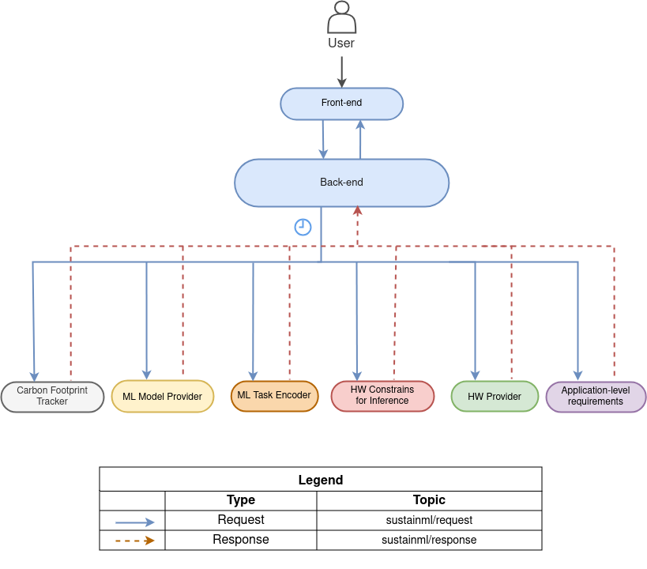

.. _node_config_service:

Node Configuration Service
--------------------------

This service enables **real-time, dynamic configuration and information request** of any module node in the system.
For details on the service request and request types specification in the IDL,
please refer to the :ref:`Service Types <service_types>`.

The orchestrator exposes a **synchronous RPC** over DDS via the `configuration_request()` API.
When a client invokes `configuration_request(RequestType)` the call **blocks** until the target node processes the request and returns a `ResponseType`.
You can use this RPC to:

  * **Query** a node’s current configuration
  * **Update** a node’s configuration with new settings

Requests and replies are exchanged as **JSON** objects encoding:

- **node_id**: identifies the target node
- **transaction_id**: tracks each request–response pair
- **configuration**: carries the new or current settings

On success, the response returns the updated configuration; on failure, an error code and message are provided.
